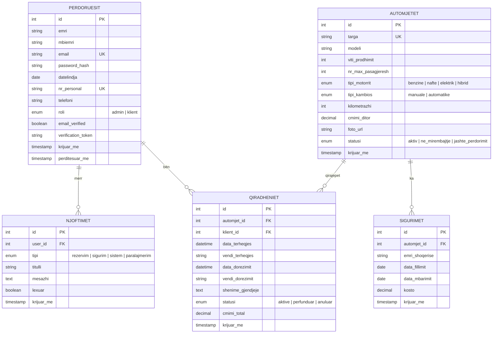
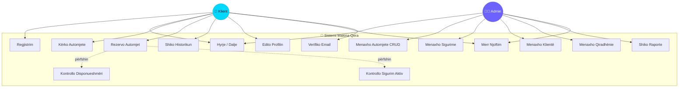
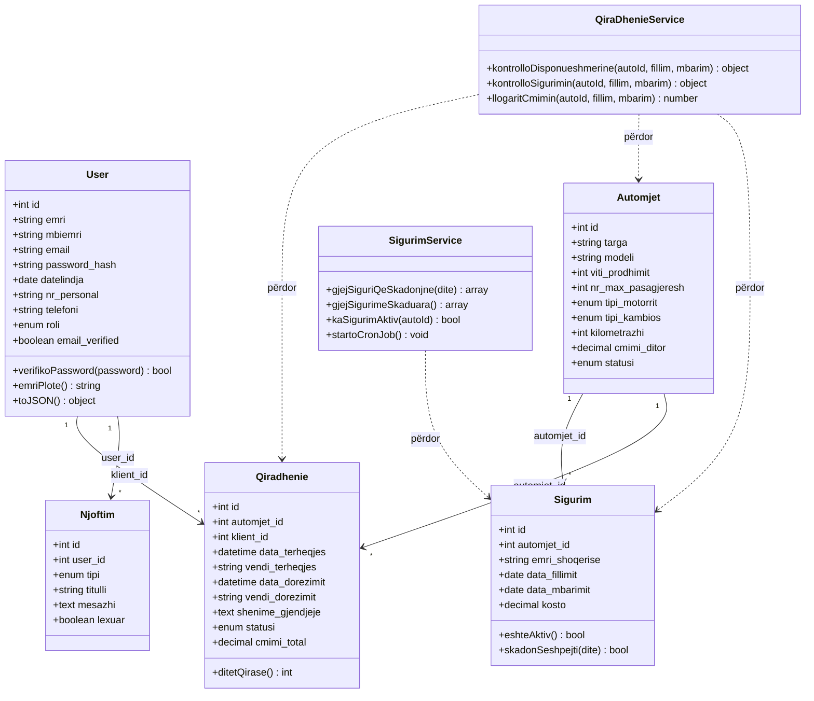
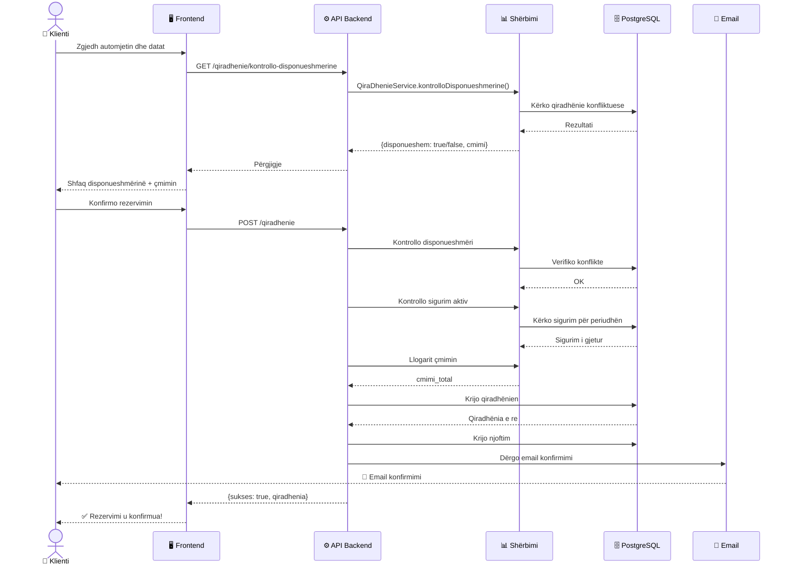
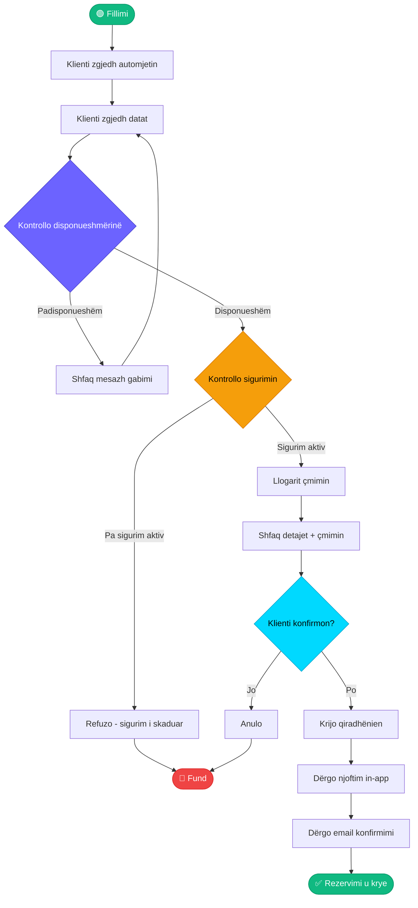
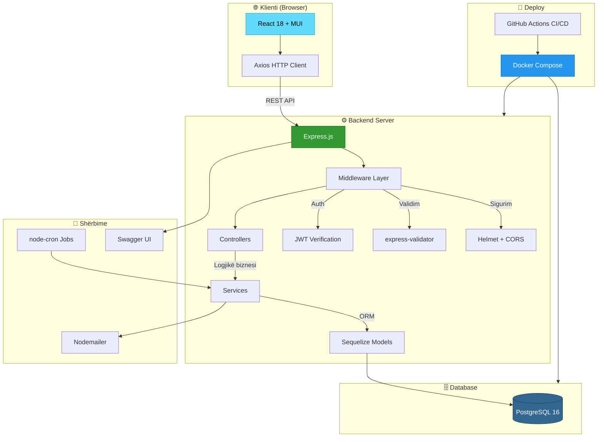
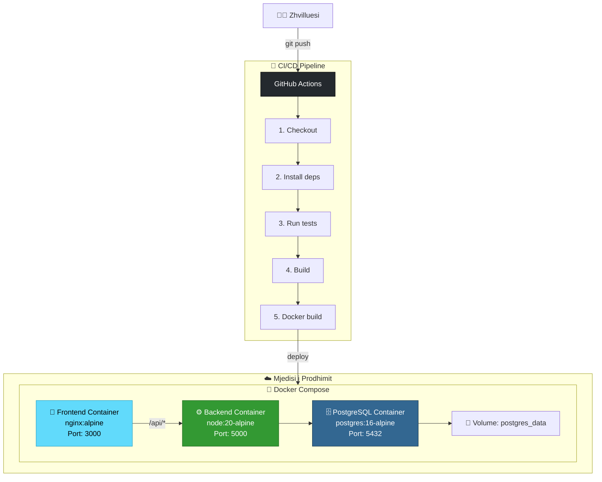

# Makina Qera — Dokumentim Teknik

## Sistemi Dixhital i Menaxhimit të Qiradhënies së Automjeteve

---

## 1. Përshkrimi i Projektit

**Makina Qera** është një aplikacion full‑stack për menaxhimin e një kompanie qiradhënie automjetesh. Sistemi përfshin:

- Menaxhimin e automjeteve (CRUD)
- Menaxhimin e sigurimeve me kontrolle automatike
- Regjistrimin dhe verifikimin e klientëve
- Procesin e qiradhënies me kontroll disponueshmërie
- Autentikim dhe autorizim me role (Admin/Klient)
- Raporte dhe statistika
- Njoftimet in-app dhe me email
- API dokumentim me Swagger/OpenAPI

### Teknologjitë e Përdorura

| Shtresë | Teknologjia |
|---------|-------------|
| Backend | Node.js 20 + Express.js |
| Bazë të dhënash | PostgreSQL 16 |
| ORM | Sequelize 6 |
| Frontend | React 18 + Vite 5 |
| UI Library | Material UI (MUI) 5 |
| Autentikim | JWT (JSON Web Tokens) |
| Validim | express-validator |
| Email | Nodemailer |
| Testim | Jest + Supertest |
| Deploy | Docker + Docker Compose |
| CI/CD | GitHub Actions |
| Dokumentim API | Swagger / OpenAPI 3.0 |

---

## 2. Diagrami ER (Entity-Relationship)



---

## 3. Diagrami i Rasteve të Përdorimit (Use Case Diagram)



---

## 4. Diagrami i Klasave (Class Diagram)



---

## 5. Diagrami i Sekuencës — Procesi i Rezervimit



---

## 6. Diagrami i Aktivitetit — Procesi i Qiradhënies



---

## 7. Diagrami i Arkitekturës



---

## 8. Struktura e API Endpoints

### 8.1 Autentikim (`/api/auth`)

| Metoda | Rruga | Përshkrimi | Akses |
|--------|-------|------------|-------|
| POST | `/regjistrim` | Regjistrim i ri | Publik |
| POST | `/hyrje` | Hyrje (login) | Publik |
| GET | `/verifiko-email/:token` | Verifiko email | Publik |
| GET | `/profili` | Profili aktual | Autentikuar |
| PUT | `/profili` | Përditëso profilin | Autentikuar |

### 8.2 Automjete (`/api/automjete`)

| Metoda | Rruga | Përshkrimi | Akses |
|--------|-------|------------|-------|
| GET | `/` | Lista me filtrime | Publik |
| GET | `/:id` | Detajet | Publik |
| POST | `/` | Krijo automjet | Admin |
| PUT | `/:id` | Përditëso | Admin |
| DELETE | `/:id` | Fshi | Admin |

### 8.3 Sigurime (`/api/sigurime`)

| Metoda | Rruga | Përshkrimi | Akses |
|--------|-------|------------|-------|
| GET | `/` | Lista | Admin |
| GET | `/qe-skadojne` | Që skadojnë brenda 30 ditëve | Admin |
| GET | `/:id` | Detajet | Admin |
| POST | `/` | Krijo sigurim | Admin |
| PUT | `/:id` | Përditëso | Admin |
| DELETE | `/:id` | Fshi | Admin |

### 8.4 Klientë (`/api/kliente`)

| Metoda | Rruga | Përshkrimi | Akses |
|--------|-------|------------|-------|
| GET | `/` | Lista e klientëve | Admin |
| GET | `/:id` | Detajet | Admin |
| PUT | `/:id` | Përditëso | Admin |
| DELETE | `/:id` | Fshi | Admin |

### 8.5 Qiradhënie (`/api/qiradhenie`)

| Metoda | Rruga | Përshkrimi | Akses |
|--------|-------|------------|-------|
| GET | `/` | Lista (admin=të gjitha, klient=vetëm e tij) | Autentikuar |
| GET | `/kontrollo-disponueshmerine` | Kontrollo disponueshmërinë | Autentikuar |
| GET | `/:id` | Detajet | Autentikuar |
| POST | `/` | Krijo qiradhënie | Autentikuar |
| PUT | `/:id/statusi` | Ndrysho statusin | Admin |

### 8.6 Raporte (`/api/raporte`)

| Metoda | Rruga | Përshkrimi | Akses |
|--------|-------|------------|-------|
| GET | `/statistika` | Statistikat e dashboard | Admin |
| GET | `/perdorimi` | Raporti i përdorimit | Admin |
| GET | `/sigurime` | Raporti i sigurimeve | Admin |

### 8.7 Njoftimet (`/api/njoftimet`)

| Metoda | Rruga | Përshkrimi | Akses |
|--------|-------|------------|-------|
| GET | `/` | Lista e njoftimeve | Autentikuar |
| PUT | `/:id/lexo` | Shëno si të lexuar | Autentikuar |
| PUT | `/lexo-te-gjitha` | Lexo të gjitha | Autentikuar |

---

## 9. Metodat dhe Pattern-et e Përdorura

### 9.1 Design Patterns

| Pattern | Ku përdoret | Arsyeja |
|---------|-------------|---------|
| **MVC** | Backend komplet | Ndarje e qartë e detyrave: Models, Controllers, Routes |
| **Repository Pattern** | Sequelize ORM | Abstraktim mbi bazën e të dhënave |
| **Service Layer** | QiraDhenieService, SigurimService | Logjika e biznesit e izoluar nga controllers |
| **Middleware Pattern** | Express middleware chain | Autentikim, validim, trajtim gabimesh |
| **Singleton** | Sequelize instance | Një lidhje e vetme me DB |
| **Observer Pattern** | Cron jobs + Njoftimet | Njoftim automatik kur ndodhin ngjarje |
| **Provider Pattern** | React AuthContext | Menaxhimi i gjendjes së autentikimit |
| **Protected Route** | React Router | Kontroll aksesi bazuar në role |

### 9.2 Parimet e Sigurisë

- **Hashing**: Fjalëkalimet ruhen me bcrypt (12 raunde)
- **JWT**: Token-et kanë afat skadence (7 ditë)
- **CORS**: Kufizuar vetëm në frontend URL
- **Helmet**: Headers sigurie HTTP
- **Input Validation**: express-validator për çdo input
- **SQL Injection**: Parandaluar nga Sequelize ORM (parameterized queries)
- **Role-Based Access Control**: Admin vs Klient me middleware

### 9.3 Metodologjia e Testimit

- **Unit Tests**: Logjika e shërbimeve (QiraDhenieService, SigurimService)
- **Integration Tests**: API endpoints me supertest
- **Coverage Target**: ≥ 80% (branches, functions, lines, statements)
- **Test DB**: PostgreSQL i veçantë (makina_qera_test)

---

## 10. Diagrami i Deploymenti



---

## 11. Seed Data (Të Dhënat Shembull)

| Entiteti | Sasia | Shembuj |
|----------|-------|---------|
| Përdorues | 6 | 1 admin + 5 klientë |
| Automjete | 10 | Toyota Corolla, VW Golf, Mercedes C-Class, BMW X3, Tesla Model 3, etj. |
| Kompani sigurimi | 5 | Sigal UNIQA, Eurosig, Albsig, Insig, Intersig VIG |
| Sigurime | 20 | 10 aktive + 10 historike |
| Qiradhënie | 8 | Aktive, përfunduara, anuluara |
| Njoftimet | 4 | Sistem, rezervim, sigurim |

### Kredencialet Demo

```
Admin:   admin@makinaqera.al   / Admin123!
Klient:  andi.hoxha@email.com  / Klient123!
```

---

## 12. Struktura e Dosjes së Projektit

```
makina-qera/
├── backend/
│   ├── src/
│   │   ├── config/          # Konfigurimet (database, auth)
│   │   ├── middleware/       # Auth, validim, error handler
│   │   ├── models/           # Sequelize modelet (5 modele)
│   │   ├── controllers/      # Request handlers (7 controllers)
│   │   ├── services/         # Logjika e biznesit (2 services)
│   │   ├── routes/           # Express rrugët (7 route files)
│   │   ├── utils/            # Email utility
│   │   ├── seeders/          # Seed data
│   │   └── app.js            # Express app setup
│   ├── tests/                # Jest testet (4 test suites)
│   ├── swagger.js            # OpenAPI config
│   ├── server.js             # Entry point
│   └── package.json
├── frontend/
│   ├── src/
│   │   ├── api/              # Axios API client
│   │   ├── components/       # UI Components (4)
│   │   ├── context/          # Auth Context
│   │   ├── pages/
│   │   │   ├── admin/        # 5 faqe admin
│   │   │   ├── auth/         # 2 faqe auth
│   │   │   └── client/       # 4 faqe klient
│   │   ├── theme.js          # MUI dark theme
│   │   ├── App.jsx           # Routing
│   │   └── main.jsx          # Entry
│   └── package.json
├── docs/
│   └── DOCUMENTATION.md      # Ky dokument
├── docker-compose.yml
├── Dockerfile.backend
├── Dockerfile.frontend
├── nginx.conf
├── .github/workflows/ci.yml
└── README.md
